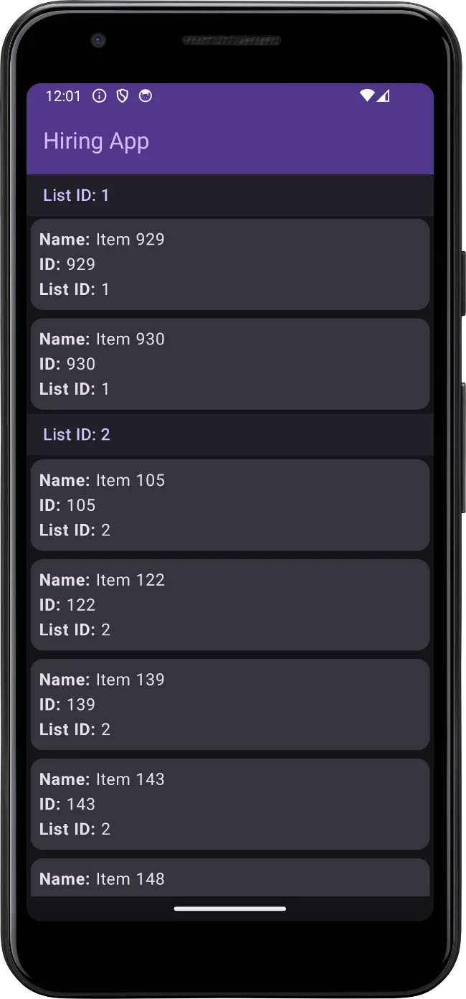

# Hiring App
* This is a simple application leveraging Jetpack Compose and Retrofit.
* It uses the [fetch-hiring]( https://fetch-hiring.s3.amazonaws.com/hiring.json) API.
* The app grabs the data from the API and displays it in an organized list with sticky headers.

## Screenshot

